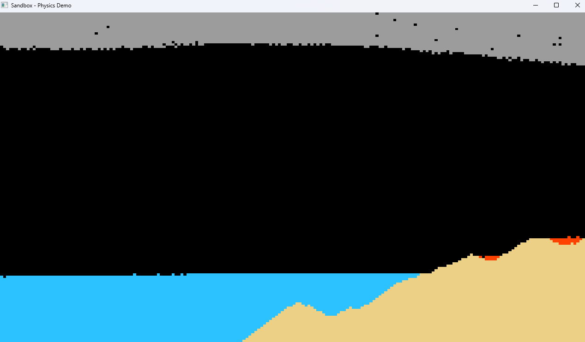

# Falling Sand Engine (SIMULATION)

A real-time 2D particle sandbox simulation with physics-based interactions. Features sand, water, and walls with realistic movement behaviors.

## Screenshots

## Features

- **Sand** - Falls downward, rolls down slopes
- **Water** - Flows downward and sideways, can be displaced by sand
- **Walls** - Static obstacles that block particle movement
- Real-time world editing (LMB/RMB)
- 60 FPS rendering

## TODO

- [ ] Optimize rendering with VertexArray (10x performance boost)
- [ ] Variable brush size (mouse wheel)
- [ ] Pause simulation (Spacebar)
- [ ] Save/load worlds

- [ ] Temperature system (hot/cold particles)
- [ ] New particles: Fire, Smoke, Lava, Steam
- [ ] State changes: Water → Steam, Sand → Glass
- [ ] Density-based layering (oil floats on water)

## Controls

| Key | Action |
|-----|--------|
| `1` | Select Sand |
| `2` | Select Water |
| `3` | Select Wall |
| `4` | Select Oil |
| `5` | Select Lava |
| `6` | Select Smoke |
| `LMB` | Place particle |
| `RMB` | Delete particle |
| `ESC` | Exit |